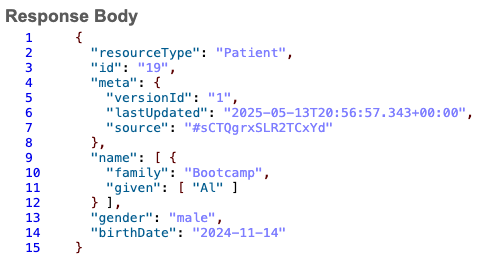

# FHIR Appointment Scheduler with LLM Integration

This project provides a functional, local interface for scheduling FHIR-compliant medical appointments using free-text input and large language model (LLM) assistance. It includes both backend utilities for generating FHIR resources and a user-facing Gradio UI to capture appointment details.

---

## 📁 Project Structure

### `llm_interface_newReason.py`
This is the main script that:
- Launches a Gradio web interface on your local machine (port 8081).
- Accepts patient data (name, DOB, gender, reason for visit) via text fields.
- Uses an LLM (e.g., OpenAI/Gemini) to refine the reason for visit.
- Calls utility functions from `fhir_utils.py` to generate and (optionally) submit a FHIR Appointment resource.

### `fhir_utils.py`
This module contains utility functions to:
- Build FHIR-compliant `Appointment` and `Patient` resources.
- Format input data into FHIR-ready JSON.
- Post the Appointment data to a running FHIR server via REST.

---

## 🖥️ Interface Preview

### Patient Input and Result


---

### Generated FHIR Appointment Resource


---

### Generated FHIR Patient Resource


---

## ⚙️ Requirements

Install dependencies using:

```bash
pip install gradio python-dotenv openai requests
```

Also, ensure you have access to a running **HAPI FHIR server** (or equivalent) at a known base URL.

---

## 🚀 Running the Application

1. Clone or download the project files.
2. Create a `.env` file with your API keys and FHIR server URL. Example:

```env
FHIR_BASE_URL=http://localhost:8080/fhir
OPENAI_API_KEY=your-key-here
```

3. Run the interface:
```bash
python llm_interface_newReason.py
```

4. Visit `http://localhost:8081` in your browser to use the tool.

---

## ✨ Features

- ✅ Clean Gradio UI with themed layout
- ✅ Integration with LLM to refine "reason for visit"
- ✅ Automatic creation of FHIR Appointment and Patient resources
- ✅ Local testing against FHIR-compliant servers

---

## 📌 Notes

- The application does not store patient data and is intended for demonstration or development use only.
- LLM-based refinement assumes proper configuration of API access to OpenAI or Gemini.

---

## 🧑‍💻 Author

Josh Richardson, PhD, MS, MLIS  
[LinkedIn](https://www.linkedin.com/) | [GitHub](https://github.com/jrich71)

---

## 📄 License

MIT License – use freely with attribution.
