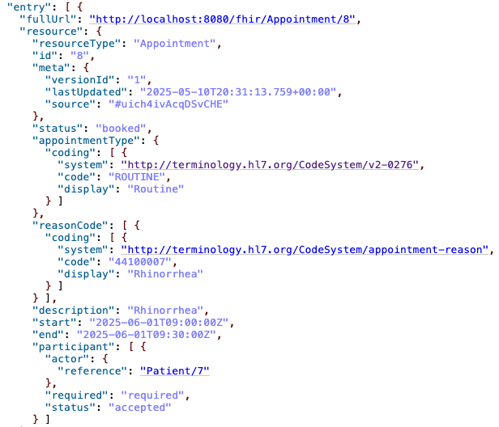

# FHIR Appointment Scheduler (WIP)

This project is a work-in-progress prototype that integrates **LLM-driven language refinement** with **FHIR-compliant resource creation**. The app allows users to submit natural language reasons for medical visits, which are refined and structured using **Google Gemini 1.5 Flash**, and then used to create `Patient` and `Appointment` resources on a local **HAPI FHIR server**.

---

## 🧠 What It Does

- Accepts patient input via a simple **Gradio interface**
- Uses **Gemini 1.5 Flash** to:
  - Refine a user's natural-language "reason for visit"
  - Select an appropriate FHIR `appointmentType` code from [v2-0276](https://terminology.hl7.org/CodeSystem/v2-0276)
  - Recommend a SNOMED/FHIR `reasonCode` and display
- Sends data to a **FHIR server** using the [SMART-on-FHIR `fhirclient`](https://github.com/smart-on-fhir/client-py) library

---

## 📄 Files

### `llm_interface_newReason.py`

This file launches the main interface and performs the following:

- Builds a structured prompt for Gemini
- Parses Gemini’s JSON response (after stripping Markdown if present)
- Normalizes inputs (e.g., gender and DOB formatting)
- Calls `FHIRConnector` to:
  - Create a `Patient` resource
  - Create an `Appointment` resource based on Gemini’s reasoning
- Runs a Gradio UI on `http://localhost:8081`

### `fhir_utils.py`

This module defines a `FHIRConnector` class, which abstracts the interaction with the HAPI FHIR server. It handles:

- ✅ Patient creation:
  - Full name (first, middle, last, prefix, suffix)
  - Contact info (email, phone)
  - Gender and birthdate
  - Optional identifiers
- ✅ Appointment creation:
  - Start and end time
  - Patient participant (required and accepted)
  - Appointment type (`appointmentType` from FHIR v2-0276)
  - Reason code (`reasonCode` with SNOMED or FHIR vocabulary)
  - Optional description
- ✅ Record retrieval:
  - `get_patient(patient_id)`
  - `get_appointment(appointment_id)`

Sample usage is included in the `__main__` block for direct testing.

---

## 📁 Directory Structure

```
project/
├── llm_interface_newReason.py    # Gradio + Gemini + FHIR integration
├── fhir_utils.py                 # FHIR resource creation and access
├── .env                          # Contains API keys
└── README.md                     # This file
```

---

## 🧪 Example Gemini Prompt

```text
The patient described the reason for their visit as: 'I've had a sore throat for two weeks.' 
Return a JSON object with the following fields only:
- refined_reason
- appointment_type_code
- appointment_type_display
- reason_code
- reason_display
Respond with JSON only. Do not include code blocks or natural language.
```

### Expected Response:

```json
{
  "refined_reason": "Evaluation of persistent sore throat",
  "appointment_type_code": "CONSULT",
  "appointment_type_display": "Consultation",
  "reason_code": "267036007",
  "reason_display": "Sore throat"
}
```

### Example Input and Output

#### A screenshot of user input (left) and resulting output to the FHIR server (right)


#### A screenshot of patient information in a HAPI FHIR server


#### A screenshot of appointment information in a HAPI FHIR server



---

## 🔐 Environment Setup

Create a `.env` file in the root directory with the following content:

```
GOOGLE_API_KEY=your_gemini_api_key_here
```

---

## 📦 Installation

Install dependencies:

```bash
pip install gradio google-generativeai python-dotenv fhirclient
```

Ensure your HAPI FHIR server is running locally on port `8080`.

---

## 🚀 Running the App

```bash
python llm_interface_newReason.py
```

Then open your browser to:  
[http://localhost:8081](http://localhost:8081)

---

## 🧭 Next Steps

- [ ] Validate Gemini-suggested codes against official value sets
- [ ] Allow user to select or override appointment time
- [ ] Extend interface to include practitioner scheduling
- [ ] Implement error handling for edge cases and timeouts
- [ ] Expand vocabulary and mappings for multilingual inputs

---

## 🤝 Acknowledgments

- [Google Gemini 1.5 Flash](https://ai.google.dev)
- [SMART-on-FHIR Python Client](https://github.com/smart-on-fhir/client-py)
- [HL7 FHIR Specification](https://www.hl7.org/fhir/)
